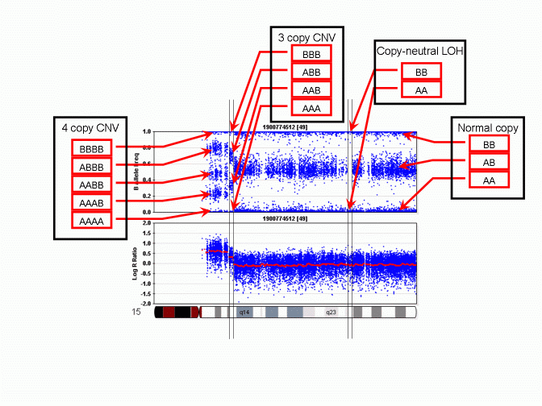
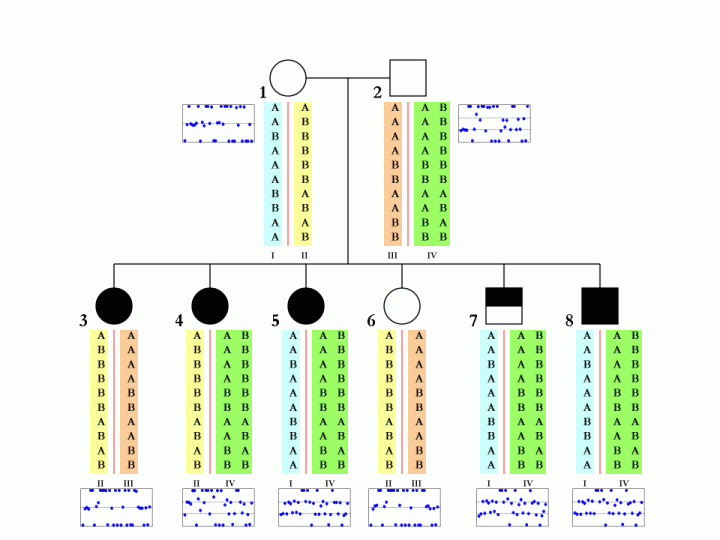
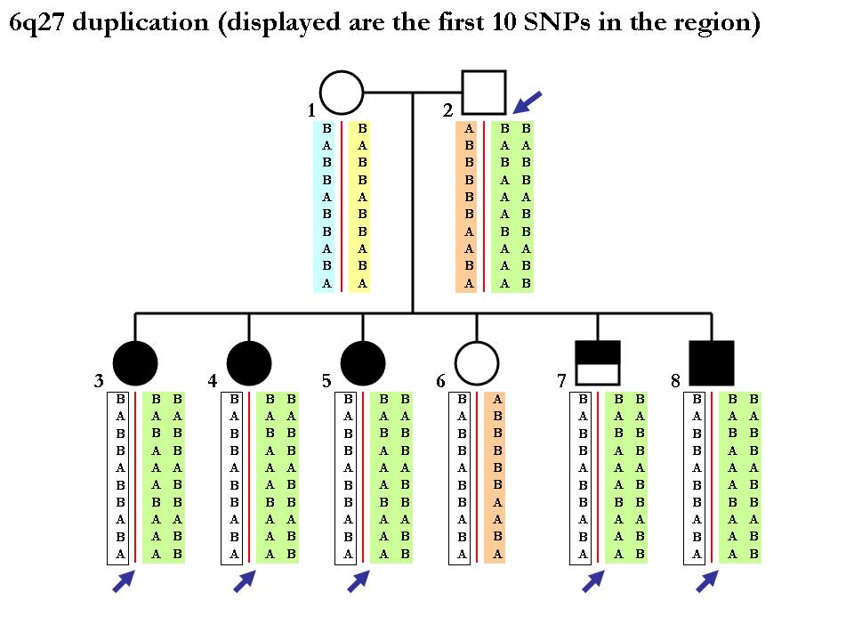
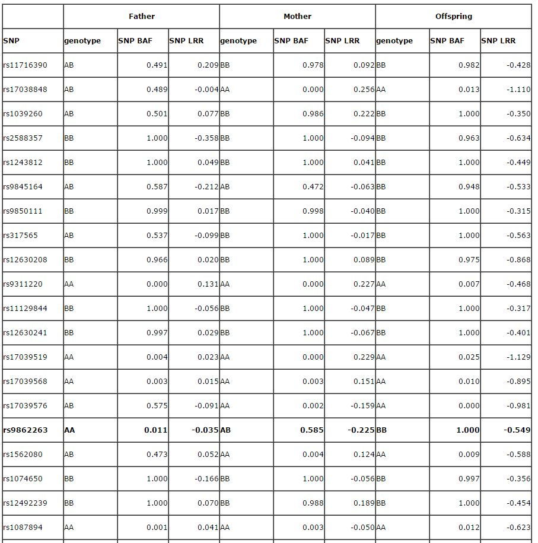

## Introduction

In a diploid genome without CNVs, each SNP genotype call is composed of two allele calls from two homologous chromosomes. If using A and B to denote the two possible alleles for a diallelic marker, then the three possible genotype calls are AA, AB and BB, respectively.

However, unlike a regular SNP genotype call that may be given by genotype calling software, in a CNV region, the "CNV-based SNP genotype call" could be composed of zero, one, three or even more allele calls. An example is given in the PennCNV paper in Genome Research. The figure is reproduced below:



As we can see, when there is a 3-copy CNV, there are four possible SNP allele composition within the CNV, including AAA, AAB, ABB and BBB. For each location in the genome that have a genotyped SNP, the CNV-based SNP genotype call can be inferred from the B Allele Frequency values. The above figure does not show deletion, but it is obvious that when there is a single-copy deletion, the two possible CNV-based SNP genotypes are A and B, respectively.

Note: I did not use the term "CNV genotype" in the above description. Practically, "CNV genotype" is better used to describe the CN state of two homologous chromosomes; for example, in a common CNV region, a CNV genotype can be 1+0 or1+1 or 0+1. This term has nothing to do with the actual SNP allele composition within the CNV.

Note: An often-touted concept in some other CNV calling software is the so-called "allele-specific CNV call". This is a very confusing concept to use, because when people use this term, they were actually referring to the scenario such as "2 A allele, 1 B allele" for a particular marker within a particular duplication, as opposed to "2 copies in paternal chromosome, 1 copy in maternal chromosome" which should be the right way to use. In PennCNV, if a user wants to get so-called "allele-specific CNV call", then it is simply the BAF value multiplied by the CN estimate. It is as simple as that. (People make a big deal about "allele-specific CNV call" because most other algorithms do not consider the BAF in the calling procedure.)

## Infer SNP allele composition in each of the two homologous chromosomes

When family data is available, that is, when father, mother and child are all genotyped and when their CNV calls are generated by PennCNV, it is possible (but not always deterministic) to disambiguate the SNP allele composition in each of the two homologous chromosomes in parental genome. This is especially true when multiple children are genotyped in the same family. An example is shown below:



The boxes below each individual in the pedigree denote the BAF values in the CNV region, and each blue dot represent one SNP in the corresponding individual. The different colors (cyan, yellow, orange, green) for the SNP alleles denote different homologous chromosomes. There are a total of four parental chromosomes, and the allele transmission pattern is inferred, based on the pedigree structure, the CNV calls, as well as the signal intensity values for each of the six children.

To make this a little more clear, we can examine the first SNP in the figure. The father (subject 2, with 3-copies) has a SNP allele composition of AAB, while the mother (subject 1, with normal 2-copy) has a SNP allele composition of AA. There are two major possibilities for the father: maybe the SNP allele composition is AA+B in two homologous chromosomes, or maybe it is A+AB in two homologous chromosomes. Without offspring data, we would not tell. However, based one child (subject 4), who has a SNP allele composition of AAB, we can confidently tell that the father should have A in one homologous chromosome and AB in the other. Similar logic can be applied to other SNPs and other offspring in the family.

The PennCNV package provides a convenience script to help infer total SNP allele composition for each marker within a CNV. Once the user has this information, it is relatively straitforward to infer SNP allele composition within each homologous chromosome for each marker within a CNV. Suppose that the signal intensity file names for the above eight individuals are sample1.txt, sample2.txt, ..., sample8.txt, respectively. Suppose that we have already run PennCNV through this family, and inferred the CN for each individual in this region as 2, 3, 2, 3, 3, 2, 3, 3, respectively. Now we can run the command below:

```
[kaiwang@cc ~/penncnv/example]$ infer_snp_allele.pl -pfb example.pfb -hmm example.hmm -allcn 23233233 -start rs11716390 -end rs17039742 -out tempfile sample1.txt sample2.txt sample3.txt sample4.txt sample5.txt sample6.txt sample7.txt sample8.txt
```

In the command, eight signal files are provided, and the --allcn argument is provided with eight digits, corresponding to eight CN estimates for these eight files.

Again note that the procedure of inferring SNP alleles in each homologous chromosome may not be deterministic. Below is one example (from the same pedigree) showing that we cannot tell the two chromoosmes apart from the CNV calls per se. Since the mother is homozygous normal copy, we cannot tell how which maternal chromosomes that each of the children get. (In principle, it is possible to tell if using neighboring SNP markers in a phasing software but this is far outside the scope of our discusion here.)



## Assigning P-values to de novo CNV calls (validating predicted de novo CNVs)

De novo CNVs (those in offspring but not in parents) are especially interesting in many family-based studies, since many people take for granted that de novo CNVs are the culprit variants responsible for diseases in offspring (which may or may not be correct). PennCNV provides a trio-based calling algorithm that helps eliminating false positive de novo CNV calls, when the father or mother has the CNV but was missed from individual-based calling algorithm. However, since de novo CNVs are very important to study, in many cases, researchers want to have even higher confidence in de novo CNVs for selection of CNVs for expeirmental validation. Therefore, PennCNV provides a special script for the sole purpose of assigning P-values to de novo CNV calls.

The basic concept is quite simple and is described in the 2007 Genome Research paper on PennCNV. Here I reproduce the Supplementary Table 2 in that paper below for illustrating the concept:



The above table shows the BAF and LRR for the father, mother and the child, respectively, for 50 SNP markers in a CNV region. PennCNV gives a deletion CNV call for the child, but not for the father or the mother. So it is potentially a de novo CNV, but are we confident that this is really a de novo CNV? In the Genome research paper, we describe the scenario as below:

> Family information can be also used to extract more biological knowledge from detected CNVs, such as inferring the parental origin of predicted de novo CNVs. To illustrate this, consider a scenario where the father and mother genotypes at a SNP marker are AA and AB, respectively, and the PennCNV algorithm identified a de novo deletion in the offspring encompassing this SNP. If the offspring genotype call is BB (or when B Allele Frequency indicates that the actual genotype is B in the presence of “No Call” genotype), we can infer that the de novo event happened on the paternal chromosome. Similarly, when the father, mother and offspring genotypes are AA, BB and AA, respectively, we can infer that the de novo event happened on the maternal chromosome.

So let us take a look at the above example with 50 SNPs within the CNV region in all family members. A total of 13 SNPs are informative for this analysis and they were marked in bold fonts. We can unambiguously determine that the de novo event occurred on the paternal chromosome for all 13 SNPs, and on the maternal chromsome for ZERO SNP. If we do a binomial test (against expectation of 0.5), we would have a two-sided P-value of 0.0002, which means that it is highly unlikely to be a random observation. Therefore, we have high confidence that the predicted de novo CNV is a bona fide de novo CNV.

The PennCNV package provides a convenience script to automate the entire process above, and assigns P-values to predicted de novo CNV calls (currently for autosomes only). In the `example/` directory in the PennCNV distribution, we can test the following command (since we know that there is a de novo CNV call in chr3 for the offspring already):

```
[kaiwang@cc ~/penncnv/example]$ infer_snp_allele.pl -pfb example.pfb -hmm example.hmm -denovocn 1 father.txt mother.txt offspring.txt -start rs11716390 -end rs17039742 -out tempfile 
NOTICE: Reading marker coordinates and population frequency of B allele (PFB) from example.pfb ... Done with 93129 records
NOTICE: For the region chr3:3974670-4071644, 50 markers were identified from father.txt
NOTICE: For the region chr3:3974670-4071644, 50 markers were identified from mother.txt
NOTICE: For the region chr3:3974670-4071644, 50 markers were identified from offspring.txt
NOTICE: Analyzing trio father.txt mother.txt offspring.txt
NOTICE: Evidence for parental origin for the putative de novo CNVs (CN=1 in father.txt mother.txt offspring.txt ): Marker= 50 Paternal_origin(F)= 13 Maternal_origin(M)= 0 P-value= 0.000244140625
```

In the command line, the `--denovocn` argument tells the program to analyze de novo CNV with CN=1 in offspring (assuming that father and mother have normal copy). The above example shows that among the 50 markers, 13 support paternal origin, 0 supports maternal origin, with a P-value of 0.0002. To get the CNV-based genotype calls, we can examine the tempfile:

```
[kaiwang@cc ~/penncnv/example]$ cat tempfile
Name LRR_F LRR_M LRR_O BAF_F BAF_M BAF_O GENO_F GENO_M GENO_O Origin
rs11716390 0.2092923 0.09235584 -0.4278845 0.4907618 0.9784126 0.9822458 AB BB B ?
rs17038848 -0.004215824 0.2558437 -1.109897 0.4892911 0 0.01307535 AB AA A ?
rs1039260 0.07700891 0.2215091 -0.3504313 0.5013204 0.9855123 1 AB BB B ?
rs2588357 -0.3579353 -0.09411527 -0.6344969 1 1 0.9628402 BB BB B ?
rs1243812 0.04895722 0.04061332 -0.4493185 1 1 1 BB BB B ?
rs9845164 -0.2121677 -0.06280199 -0.5333947 0.5868546 0.4724992 0.9484559 AB AB B ?
rs9850111 0.01715749 -0.04008884 -0.315464 0.9993086 0.9983963 1 BB BB B ?
rs317565 -0.09888031 -0.01671213 -0.563325 0.5369598 1 1 AB BB B ?
rs12630208 0.02047303 0.08898977 -0.8683601 0.9662933 1 0.9748526 BB BB B ?
rs9311220 0.130745 0.2272046 -0.4676653 0 0 0.007175446 AA AA A ?
rs11129844 -0.05558765 -0.04681602 -0.316947 1 1 1 BB BB B ?
rs12630241 0.02908731 -0.0665196 -0.4010261 0.9974409 1 1 BB BB B ?
rs17039519 0.02282252 0.2286292 -1.129272 0.003655733 0 0.02502375 AA AA A ?
rs17039568 0.01544927 0.1511088 -0.895263 0.003425092 0.002528912 0.00989458 AA AA A ?
rs17039576 -0.09121598 -0.1585987 -0.9806429 0.5749596 0.001887937 0 AB AA A ?
rs9862263 -0.03493896 -0.2254546 -0.54909 0.01089725 0.5850205 1 AA AB B F
rs1562080 0.05211602 0.123653 -0.5881565 0.4732358 0.003651135 0.00945395 AB AA A ?
rs1074650 -0.1655274 -0.05582133 -0.3558519 1 1 0.9966652 BB BB B ?
rs12492239 0.07033561 0.188675 -0.4542632 1 0.9884533 1 BB BB B ?
rs1087894 0.04098149 -0.05005331 -0.6233126 0.0007424421 0.002794209 0.01204688 AA AA A ?
rs1110797 -0.02469384 0.1499064 -0.9702201 0.005881125 0.5785041 0.02985496 AA AB A ?
rs9848430 0.109309 0.06018361 -0.4467264 1 0.9935361 0.988888 BB BB B ?
rs1111441 0.2075965 -0.01782993 -0.6180044 0 0.5172579 0.98102 AA AB B F
rs4685724 0.03039831 -0.007138185 -1.084088 0.008211668 0.01290762 0.03060648 AA AA A ?
rs12152235 -0.1351283 -0.0375151 0.07032743 0.007259785 0.5782245 1 AA AB B F
rs7615618 0.03270188 -0.04653058 -0.2837792 0 0.4945571 1 AA AB B F
rs317588 -0.02314143 -0.06409753 -1.100606 1 0.007525286 0.0137145 BB AA A F
rs12490386 0.2357802 0.334967 -0.8102222 0.009186696 0.003135221 0.02083603 AA AA A ?
rs167601 0.01652723 -0.01347642 -0.4318985 0.9993362 0.5398411 0.005261022 BB AB A F
rs317593 0.0757281 -0.01952546 -0.3660798 0.004917388 1 1 AA BB B F
rs317599 0.1798452 0.07128202 -0.6679769 0.01031752 0.5747991 0.9947435 AA AB B F
rs317613 0.08216615 -0.01377377 -1.042207 1 0.5973593 0 BB AB A F
rs317616 0.168556 0.3524278 -0.5088452 0.4783121 0.006433696 0.01094362 AB AA A ?
rs13099728 -0.04942596 -0.1408342 -0.9054488 0.003269672 0.5480256 0.02916644 AA AB A ?
rs317623 0.1157649 -0.04620196 -0.9060323 1 0.554764 0.01554879 BB AB A F
rs6806504 -0.1895185 -0.1128018 -0.9621779 0.5175876 0.5209588 0.06420068 AB AB A ?
rs6806903 0.06371289 0.01157832 -0.6604852 0.4700137 0.5162509 0.01794186 AB AB A ?
rs1092733 -0.05251021 -0.05069277 -0.5229827 0.5304774 0.5244294 0.9770416 AB AB B ?
rs317605 0.01646624 0.1212866 -0.9060447 0.4989983 0.0006349169 0.01630653 AB AA A ?
rs10865894 -0.2042709 -0.1140895 -0.9258857 0.5329113 0.5048889 0.002666625 AB AB A ?
rs317606 0.1008998 0.2956575 -0.5718818 0.4711365 0.002418167 0.01234875 AB AA A ?
rs7624815 0.003270485 -0.087667 -0.5803361 1 0.9977139 0.989744 BB BB B ?
rs1987888 -0.01560016 -0.170958 -0.7969466 0.4926481 0.5152871 0.004902103 AB AB A ?
rs1087817 0.0449934 -0.1869916 -0.482709 0.9991308 0.5214391 0 BB AB A F
rs9877622 0.06223465 -0.01536013 -0.313483 0 0.003593371 0.003163114 AA AA A ?
rs11917349 0.03289355 -0.150262 -0.5454098 0.999635 0.535728 0.06175777 BB AB A F
rs17039739 -0.234773 -0.1578492 -0.8131365 0.01042593 0.01311021 0.01103648 AA AA A ?
rs317530 -0.009345899 -0.06389242 -0.3922845 0.5571331 1 1 AB BB B ?
rs317528 0.01622796 -0.05407957 -0.754784 1 0.5942135 0.01451918 BB AB A F
rs17039742 0.03041136 -0.01041109 -0.3715202 0.9953547 0.9941654 1 BB BB B ?
```

The first line of the output file tells the column header. Each line contains tab-delimited fields, representing LRR for father, mother, offspring, then BAF for father, mother, offspring, then CNV-based genotype calls for father, mother offspring, and then the parental origin (F for father, M for mother, ? for unknown). You can probably load the output to Excel (use "separate by space") for easier visual depiction.

Note that you can alternatively use `runex.pl 13` and `runex.pl 14` in the `example/` directory in PennCNV to run the two types of analysis described in this page.

 
