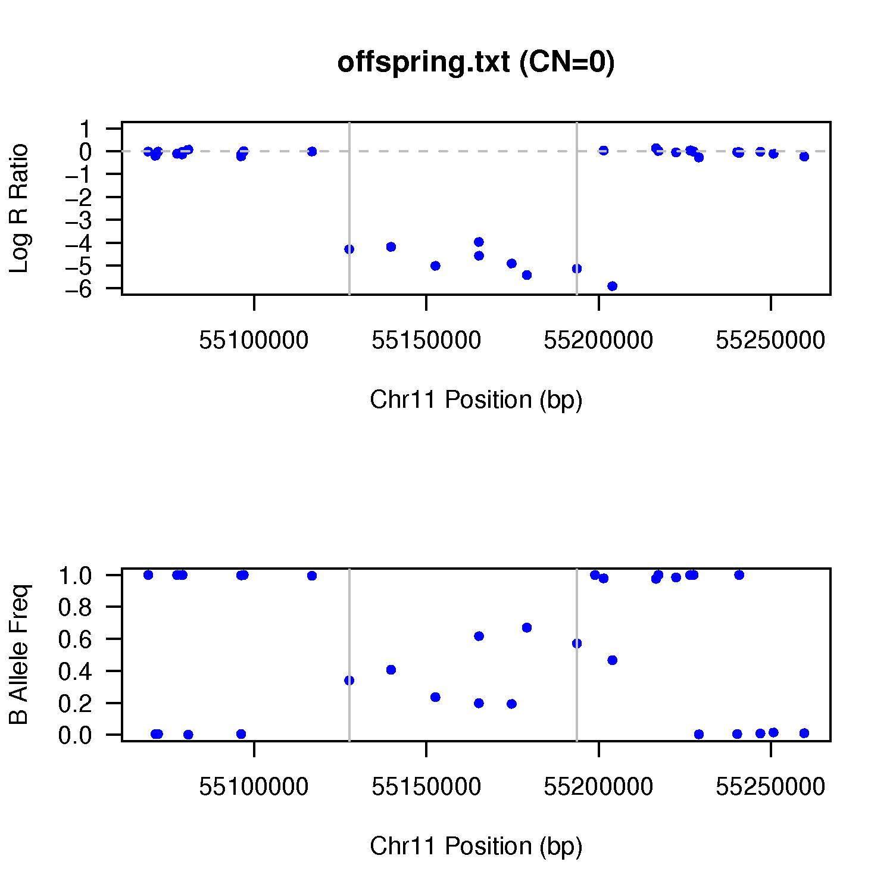
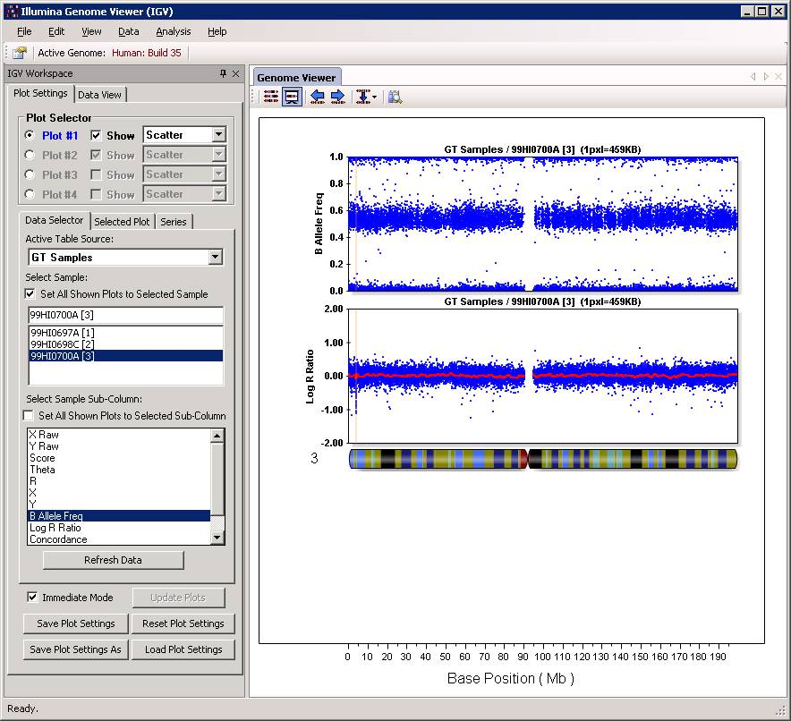
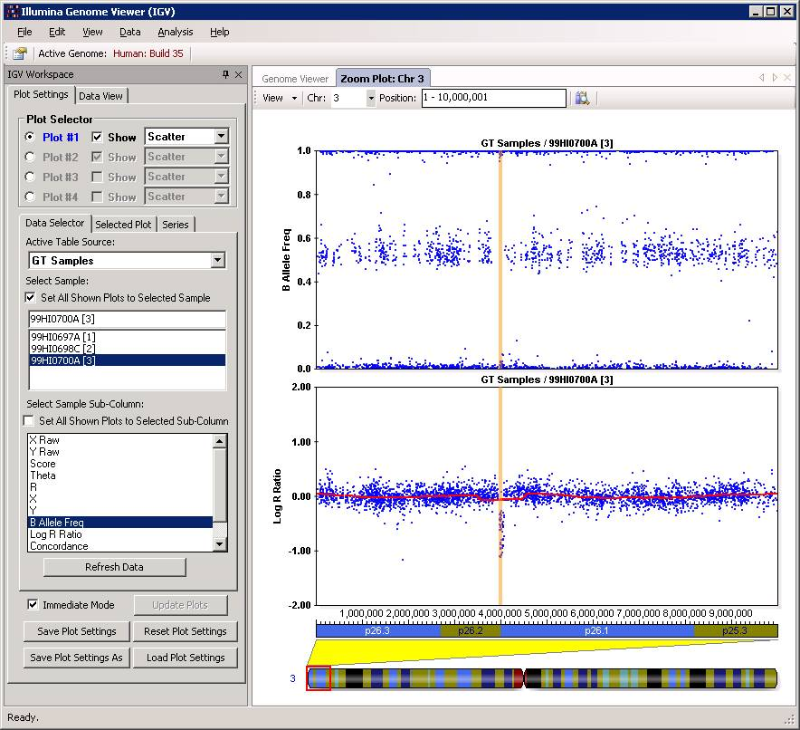

## Overview

This section gives some illustrative examples on how to manually examine the CNV calls in Genome Browser as well as in BeadStudio. In many cases, by looking at the actual signal intensity values in BeadStudio, we can gain a higher confidence in CNV calls, or immediately recognize false positive calls. Similarly, by putting the CNV calls into Genome Browser, we can compare the calls with previously reported calls in the genome, or we can see whether the call coincide with a segmental duplication region, and we can examine the surrounding genes or other functional genomic elements. 
 
## Examine CNV calls visually by signal intensity

It if often helpful to visually examine CNV calls to judge whether they are reliable or not. Doing so manually in the Illumina BeadStudio software or the Affymetrix genotyping console takes too much time and effort. Therefore, the visualize_cnv.pl program provides a convenient way to generate image files for CNV calls automatically. The example below illustrate how this can be achieved. Note that this procedure should usually work in default Linux installations, and may not work in Mac or Windows. For Mac, make sure that the R language and the ghostscript is installed (type "gs" to check about it). The ghostscript can be downloaded from http://pages.cs.wisc.edu/~ghost/.

Go to the example/ directory in the PennCNV package, first execute `runex.pl 1 --path_detect_cnv.pl ../detect_cnv.pl`. This will generate CNV calls for three subjects (`father.txt`, `mother.txt`, `offspring.txt`). Next we want to check whether the CNV calls in offspring.txt make sense or not, so we can do

```
[kaiwang@cc ~/example]$ visualize_cnv.pl -format plot -signal offspring.txt ex1.rawcnv
NOTICE: Processing sample offspring.txt CNV chr11:55127597-55193702 with copy number of 0 ... written to offspring.txt.chr11.55127597.JPG
NOTICE: Processing sample offspring.txt CNV chr11:81181640-81194909 with copy number of 1 ... written to offspring.txt.chr11.81181640.JPG
NOTICE: Processing sample offspring.txt CNV chr20:10440279-10511908 with copy number of 1 ... written to offspring.txt.chr20.10440279.JPG
NOTICE: Processing sample offspring.txt CNV chr3:3974670-4071644 with copy number of 1 ... written to offspring.txt.chr3.3974670.JPG
```

This command basically check the ex1.rawcnv file for all CNV calls made on the signal file (`offspring.txt`), and then plot the signal intensity (LRR/BAF) for these CNV calls. The plotting function requires R to work, so make sure that your system has R installed. The output file names are shown above. One CN=0 example example is given below. We can see that the LRR drop to very low levels, yet BAF randomly distribute between 0 and 1. By default, the CNV region, as well as the left side and right side region with identical sizes, are shown in the figure, with the CNV marked by two gray vertical lines.



Another CN=1 example is shown below. The LRR drop to around -0.6 region, yet the BAF cluster around either 0 or 1, but not near 0.5. It is a de novo CNV, which can be furhter validated by the de novo validation procedure.


The visualize_cnv.pl plotting function is quite rudimentary. If you want really fancy output, you can edit the source code (search to the R code section) to modify the subroutine that generates R code.

The program generates JPG output files. If you want to have PDF output so that the figures can be inserted into vector-based graphs for publication purposes, you can get an updated version from the download page. In addition, the updated version can use "Mb" rather than "bp" as the data labels in X-axis.

## Examine CNV calls in Genome Browser

The program `visualize_cnv.pl` can help convert the PennCNV output to BED format (for visualization in UCSC Genome Browser), to XML format (for visualization in Illumina BeadStudio Genome Viewer), to HTML format (beta-testing feature: for visualization in Internet web browser for family-based CNV calls).

Suppose we want to examine the CNVs in UCSC genome browser:

```
[kai@adenine penncnv]$ visualize_cnv.pl sampleall.cnv.rg18 -format bed -track 'CNV in a family' > sampleall.bed
NOTICE: converting the CNV call file sampleall.cnv.rg18 to BED format to be displayed in UCSC genome browser
```

The above command converts the CNV calls to BED format, with the track name as “CNV in a family”. The output is written to the sampleall.bed file.

Now go to http://www.genome.ucsc.edu/cgi-bin/hgGateway, make sure that the “genome” dropdown list is “human”, and the “assembly” dropdown list is “Mar 2006”. Click “add custom tracks” button, in the “paste URL or data” text box, click “browse …” and select the sampleall.bed file, then click “submit”. We will see the screen below:


Now click “go to genome browser”. In the “position/search” box, type a gene of interest, or a genomic region of interest (for example, try typing LRRN1), then use “zoom in” and “zoom out” to examine the genomic regions for CNVs. The offspring (sample3.txt) has a deletion CNV (marked as red box in the custom track) downstream of LRRN1. (However, UCSC known gene prediction shows that this deletion is within the UNQ3037 gene; in general, UCSC known gene annotation has more genes than RefSeq Gene annotations).


The track will be only visible to yourself in your web browser for a limited period of time: other people will be able to see it, so do not be afraid of uploading your data to UCSC Genome Browser.

## Examine CNV calls in BeadStudio

Some times, it may be convenient to visualize the CNV calls in BeadStudio software, so that one can manually examine the calls with respect to the Log R Ratio and B Allele Frequency values and judge whether the calls make sense or not. This idea was originally brought up and implemented by Dr. Bryan Traynor, so I adopted this approach for BeadStudio users.

This process requires an idmapfile that maps the file name (in PennCNV calls) with the sample identifier (in BeadStudio). The users will need to do some programming to do that. The file for our purpose is listed below:

```
sample1.txt     99HI0697A [1]
sample2.txt     99HI0698C [2]
sample3.txt     99HI0700A [3]
```

This is a tab-delimited file: first column is the file name (as in PennCNV calls in the `sampleall.cnv` file), while second column is the “sample ID” in BeadStudio. (This can be easily extracted from the FullDataTable if you know some programming, or you can directly “export” the SampleID column in the SamplesTable in BeadStudio). Suppose this file is called mapfile. We can now do:

```
[kai@adenine penncnv]$ visualize_cnv.pl sampleall.cnv -format beadstudio -idmap mapfile -out sampleall.xml
NOTICE: converting the CNV call file sampleall.cnv into BeadStudio bookmark format to be imported into BeadStudio software
```

Now we can go back to BeadStudio again, open the project file for the trio. Click “Tool” menu, click “show genome viewer…”. In the Genome Viewer window, click “View” menu, select “Bookmark viewer”. Then click “Import bookmark analysis file”, then select the sampelall.xml file to be loaded. We will see the window below:


Now click “Close” button, and then we can examine the CNV calls in the Illumina Genome Viewer now. An example of the de novo CNV is shown below:



Do make sure that “Immediate Mode” is checked, or click “Update Plots” every time when you change sample selections. Double clicking a region can zoom in the specific region for more detailed examination of the CNV calls. For example:



